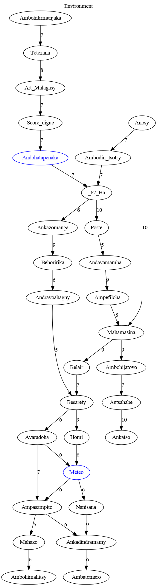

# Recherche d'itinéraire

Le problème consiste à prendre des décisions concernant les étapes spécifiques de l'itinéraire et à choisir le bus optimal pour chaque étape, en se basant sur les données du trafic. 

Prenons l'exemple d'un trajet de l'arrêt **Andohatapenaka** à l'arrêt **Meteo**. Nous avons établi une durée maximale de trajet de `120 minutes`, avec la possibilité de changer de bus `au maximum 3 fois`.

###### Route
Une liaison entre deux arrêts constitue une route, et la durée qu'un bus passe sur une route est préétablie. De surcroît, une route peut se trouver dans un état `en bon état`, `en mauvais état`, ou `en construction`, avec des implications potentielles sur la durée du trajet. 

##### Bus
Chaque bus suit un itinéraire spécifique, où un itinéraire est défini comme une séquence d'arrêts de bus. Pour ce problème, considérons les 5 bus : `119`, `144`, `147 Bleu`, `147 Rouge`, `B`. 

---

### Modélisation du problème

Soient
- $\text{BusStops} = \{ bs_i; i \in \{1, ..., n\} \}$ l'ensemble des arrêts,
- $\text{Buses} = \{ b_i; i \in \{1, ..., m\} \}$ l'ensemble des bus,
- $\text{Edge} = \{ (bs_i, bs_j); bs_i, bs_j \in \text{BusStops} \}$,
- $\text{Node} = \{ (bs, b); bs \in \text{BusStops}, b \in \text{Buses} \}$

Notons $G$ le graphe défini par $G = (\text{Node}, \text{Edge})$

Un bus a son propre trajet. Notons $\text{G}_i = ( \text{Node}_i, \text{Edge}_i)$ le trajet du bus $b_i$ : 
  - Notons $ \text{BusStops}_{b_i} = \{bs_k; bs_k \in \text{BusStops}\}_{k \in N_i} \subset \text{BusStops}$
  - Notons $ \text{Node}_{b_i} = \{(bs_k, b_i); bs_k \in \text{BusStops}\}_{k \in N_i} \subset \text{Node}$
  - Notons $ \text{Edge}_{b_i} = \{(bs_k, bs_{k+1}); bs_k, bs_{k+1} \in \text{BusStops}\}_{k \in N_i}  \subset \text{Edge}$

Notons $bs_{start} \in \text{BusStops}$ l'arrêt de départ et $bs_{end} \in \text{BusStops}$ l'arrêt d'arrivé.

Posons $\text{change bus}$ la fonction qui retourne le nombre de bus, étant donné une itinéraire

$\begin{array}{lllll}
\text{change bus} & : & \text{Node}^p & \to & \N \\
 & & n = ((bs_1,b_1), ..., (bs_p, b_p)) & \mapsto & \text{change bus}(n) \\
\end{array}$

Posons $\text{duration}$ la fonction qui retourne la durée du trajet, étant donné une itinéraire

$\begin{array}{lllll}
\text{duration} & : & \text{Node}^p & \to & \N \\
 & & n = ((bs_1,b_1), ..., (bs_p, b_p)) & \mapsto & \text{duration}(n) = d \\
\end{array}$

### Définition du problème

- Variables : ( $p$ étant le nombre d'arrêts pour arriver à destination)
  - $X = ((bs_1, b_1), ... , (bs_p, b_p))$ est une **itinéraire** : la liste des arrêts et bus entre l'arrêt de départ et l'arrêt d'arrivé
- Domaines :
  - $X \in \text{Node}^p$
- Contraintes : Pour $X = ((bs_1, b_1), ... , (bs_p, b_p))$
  - contraintes de l'environnement
    - $bs_1 = bs_{start}$ et $bs_2 = bs_{end}$
    - $\forall i, bs_i \in \text{BusStops}_{b_i}$
    - $\forall i, (bs_i, bs_{i+1}) \in \text{Edge}$
    - $\forall i \neq k, bs_i \neq bs_k$
  - contraintes de changement de bus
    - $\text{change bus}(X) \le 3$
    - $\text{duration}(X) \le 120$